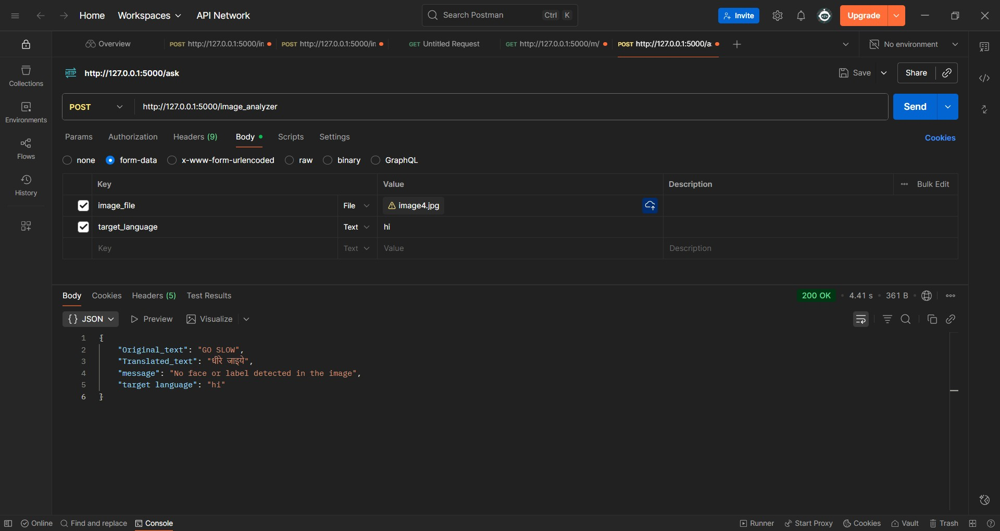

# Image Analyzer App

This is a Flask based Image Analyzer API built using the Google Cloud Vision API and Google Translation API.
It analyzes uploaded images to detect labels, text, and facial expressions and can translate detected text into 
a specified target language.

## Features
* @app.route("/image_analyzer") [POST]
    Analyzes the uploaded image and returns results based on the content detected.
   
    The API identifies objects, text, or facial expressions from an image and optionally 
    translates any detected text.

* Processing Steps: 
The image is converted to Base64 format and sent to the Google Vision API for analysis.

    Three types of detections are performed:
    1. LABEL_DETECTION: Returns object labels (e.g., “Car”, “Tree”, “Food”).
    2. TEXT_DETECTION: Extracts any visible text from the image.
    3. FACE_DETECTION: Analyzes facial expressions such as joy, anger, sorrow, and surprise.
   
    If text is detected, it is translated to the provided target_language using the Google Translation API.

* Error Handling
Custom error handlers are implemented for better API responses:
1. 400 (Bad Request): Missing or invalid image file.
2. 404 (Not Found): Missing target language for translation.

### Technologies Used
1. Flask: REST API development
2. Google Cloud Vision API: image analysis
3. Google Translation API: translating detected text
4. Python Requests: external API calls
5. dotenv: securely managing environment variables

### Setup Instructions:

1. Clone the repository and navigate to the project folder.
2. Create a .env file and add your Google API key: GOOGLE_API_KEY=your_api_key_here

* Install dependencies:
     pip install flask python-dotenv requests 
      
     Run the application: python app.py

Use Postman to send a POST request to:
http://127.0.0.1:5000/image_analyzer

Include the image file and optionally a target_language in form-data.

### Example Use Case
This API can be used for:
1. Automated image content detection (labeling or categorizing photos)
2. Text extraction and translation from signs, documents, or images
3. Emotion detection from human faces

### Sample Output
This is an output for a image with GO SLOW written on it, and the target language
is set to hindi:
